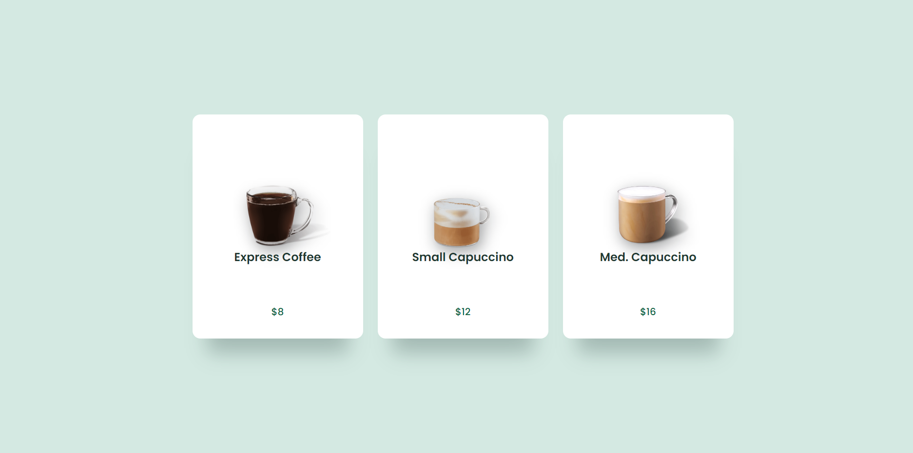

# 
 Interface de Usuário☕ 

                             </a>

 Design de interface de usuário usando HTML E CSS. 

## 🔥 Project Link

<li><a href="https://joaovporto.github.io/interface/"</li>

## 🛠️ Technologies

<li><a href="https://www.w3schools.com/css/">CSS</a></li>
<li><a href="https://www.w3schools.com/html/">HTML</a></li>

